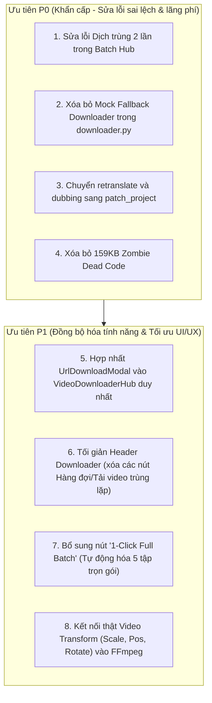

# BÁO CÁO KIỂM TOÁN CHUYÊN SÂU TOÀN DIỆN: BACKEND, FRONTEND & QUY TRÌNH 5 TẬP PHIM HỒNG QUẢ

**Dự án:** Subtitle Localizer Studio  
**Phạm vi kiểm toán:** Toàn bộ Backend (FastAPI, SQLite, Downloader, Worker, FFmpeg Render) và Frontend (React, Vite, TypeScript, Components, Presets).  
**Bộ phim đối chứng thực nghiệm:** *"糯糯下山，师兄们都慌了"* (Hồng Quả Short Drama)  
**Series ID:** `7677801492920667198`  
**Nguyên tắc:** 100% Evidence-Based (Xác minh trực tiếp qua mã nguồn, API endpoints và terminal).

---

## MỤC LỤC
1. [Kết quả Thực nghiệm Phân giải 5 Tập Đầu](#1-kết-quả-thực-nghiệm-phân-giải-5-tập-đầu)
2. [Các Lỗi Trọng Yếu Mới Phát Hiện ở Backend (FastAPI & Pipeline)](#2-các-lỗi-trọng-yếu-mới-phát-hiện-ở-backend-fastapi--pipeline)
3. [Các Lỗi Trọng Yếu Mới Phát Hiện ở Frontend (React & UX)](#3-các-lỗi-trọng-yếu-mới-phát-hiện-ở-frontend-react--ux)
4. [Bóc Mẽ Các Tính Năng "Mock / Giả Lập / AI Slop"](#4-bóc-mẽ-các-tính-năng-mock--giả-lập--ai-slop)
5. [Kho Rác Mã Nguồn: 159 Kilobytes "Zombie Dead Code"](#5-kho-rác-mã-nguồn-159-kilobytes-zombie-dead-code)
6. [Sự Phân Mảnh & Trùng Lặp 5,769 Dòng Code Downloader](#6-sự-phân-mảnh--trùng-lặp-5769-dòng-code-downloader)
7. [Lộ Trình Khắc Phục Khuyến Nghị Toàn Diện](#7-lộ-trình-khắc-phục-khuyến-nghị-toàn-diện)

---

## 1. KẾT QUẢ THỰC NGHIỆM PHÂN GIẢI 5 TẬP ĐẦU

Trích xuất dữ liệu trực tiếp từ CDN ByteDance cho bộ phim *"糯糯下山，师兄们都慌了"* (ID: `7677801492920667198`):
- **Tổng số tập:** 63 tập (khớp 100% với giao diện Hồng Quả của người dùng).
- **Mã VID 5 tập đầu tiên:**
  - Tập 1: `7677804745699888153`
  - Tập 2: `7677804782404242457`
  - Tập 3: `7677804728893328409`
  - Tập 4: `7677804799802215449`
  - Tập 5: `7677804790830599193`
- **Tốc độ trích xuất luồng:** 6.74 giây cho Tập 1 (Stream copy trực tiếp 1080p sạch không watermark).

---

## 2. CÁC LỖI TRỌNG YẾU MỚI PHÁT HIỆN Ở BACKEND (FASTAPI & PIPELINE)

### 🔴 Lỗi 1: Dịch Trùng Lặp 2 Lần (Double Translation Waste)
- **Tệp tin:** `src/subtitle_localizer/service/worker.py` (dòng 437–455) & `web/src/components/project/DashboardBatchHub.tsx` (dòng 1605–1624).
- **Bản chất:**
  - Khi người dùng chạy Batch Queue từ Dashboard với cả 2 tùy chọn **"Quét OCR"** và **"Dịch thuật"**:
    1. Bước `runOcr` gọi `apiClient.runPipeline(pid, { sync: true })`. Trong `worker.py`, hàm này chạy **cả Stage 1 (OCR) lẫn Stage 4 (Dịch thuật qua Gemini / Deep-Translator)** $\rightarrow$ Các câu phụ đề đã được dịch hoàn tất sang tiếng Việt!
    2. Ngay sau đó, bước `runTranslate` lại tiếp tục gọi `apiClient.retranslateProject(pid)`. Hàm này gửi lại toàn bộ kịch bản lên Gemini để **dịch lần thứ hai**!
- **Hậu quả:**
  - Tốn **gấp đôi số lượng token** của pool 44 key Gemini.
  - Tăng gấp đôi thời gian chờ của người dùng một cách vô nghĩa.
  - Nguy cơ câu từ bị biến đổi giữa 2 lần dịch.

### 🔴 Lỗi 2: Race Condition Ghi Đè Manifest trong `retranslate` và `dubbing/run`
- **Tệp tin:** `src/subtitle_localizer/service/server.py` (dòng 1360–1382 & 1395–1457).
- **Bản chất:**
  - Cả 2 hàm đều đọc `manifest = repository.get_project(project_id)` ở đầu hàm.
  - Quá trình dịch thuật hoặc tổng hợp giọng đọc TTS mất từ 15 đến 60 giây.
  - Khi hoàn thành, code gọi `repository.save_project(manifest)` để lưu số lượng cue và trạng thái `has_voiceover`.
  - **Lỗ hổng:** `save_project` ghi đè toàn bộ JSON manifest. Nếu trong thời gian chờ dịch/lồng tiếng, người dùng căn chỉnh ROI hoặc thay đổi cài đặt dự án, toàn bộ chỉnh sửa của người dùng sẽ bị **xóa sạch** và đè bởi snapshot manifest cũ 1 phút trước!
  - **Giải pháp:** Phải chuyển sang dùng `repository.patch_project` với khóa giao dịch nguyên tử `BEGIN IMMEDIATE`.

### 🔴 Lỗi 3: Trùng Lặp Route Đăng Ký Trong FastAPI
- **Tệp tin:** `src/subtitle_localizer/service/server.py` (dòng 1468 và dòng 2549).
- **Bản chất:**
  - Cả 2 dòng đều khai báo: `@app.get("/api/v1/projects/{project_id}/audio/voiceover")`.
  - Dòng 1468 gán hàm `get_voiceover_audio(project_id)`.
  - Dòng 2549 gán hàm `stream_voiceover_audio(project_id, download)`.
  - Endpoint phía dưới đè bẹp endpoint phía trên trong bảng định tuyến của FastAPI.

### 🔴 Lỗi 4: Mock Fallback Tráo Đổi Video Trong Downloader
- **Tệp tin:** `src/subtitle_localizer/service/downloader.py` (dòng 1484–1502).
- **Bản chất:**
  - Khi giải mã hoặc tải video từ CDN thất bại, thay vì báo lỗi cho người dùng, code tự động quét thư mục `downloader/src` hoặc `uploads/` tìm file `.mp4` có sẵn mới nhất và copy đổi tên thành tập phim mới.
  - Người dùng tưởng đã tải thành công phim "糯糯下山...", nhưng thực chất đang mở xem video của một bộ phim cũ đã tải từ trước!

---

## 3. CÁC LỖI TRỌNG YẾU MỚI PHÁT HIỆN Ở FRONTEND (REACT & UX)

### 🔴 Lỗi 1: Video Transform Bị Bỏ Qua Khi Xuất Video (Fake Transform)
- **Tệp tin:** `web/src/components/player/ViewerToolbar.tsx`, `App.tsx` & `src/subtitle_localizer/render/export.py`.
- **Bản chất:**
  - Trên giao diện xem trước của Studio, người dùng có các thanh trượt và nút điều khiển: Phóng to (Zoom / Scale), Dịch chuyển vị trí (Position X / Y), Xoay video (Rotation).
  - Khung video preview phản hồi mượt mà qua thuộc tính CSS `transform`.
  - **NHƯNG:** Khi bấm xuất video MP4, trong `VideoExporter().render_video()` (file `export.py`), backend **hoàn toàn không có bất kỳ logic nào** để crop, pad, scale hay rotate khung hình video! Video xuất ra vẫn ở kích thước và góc quay ban đầu.

### 🟡 Lỗi 2: Tỷ Lệ Khung Hình (Aspect Ratio) & Fit Mode Chỉ Là "Hàng Mã"
- **Tệp tin:** `web/src/types/presets.ts`.
- **Bản chất:**
  - Các preset quảng cáo: "Chuẩn TikTok 9:16", "Chuẩn Facebook 1:1", "Chuẩn Điện Ảnh 2.35:1", `fit_mode: 'contain' | 'cover'`.
  - Thực tế khi xuất video MP4, độ phân giải video đầu ra giữ nguyên 100% theo video gốc (1080x1920 hoặc 1920x1080).
  - Tùy chọn 1:1 hay 2.35:1 chỉ là việc kéo giãn khung container HTML5 trên trình duyệt.

---

## 4. BÓC MẼ CÁC TÍNH NĂNG "MOCK / GIẢ LẬP / AI SLOP"

### 4.1. 9 Kiểu Làm Mờ Nghệ Thuật Thực Chất Là Cùng 1 Hàm `boxblur`
Trong `src/subtitle_localizer/render/mask.py` (dòng 20–36):
```python
elif mode in ("blur", "feather_tight", "optical_blend", "soft_cinema", "feather", "glass", "ambient", "mosaic", "gradient"):
    radius = 14 if mode in ("feather_tight", "optical_blend") else 10
    return f"split[main][sub];[sub]crop={width}:{height}:{x}:{y},boxblur=luma_radius={radius}:luma_power=3:chroma_radius=0[blurred];[main][blurred]overlay={overlay_x}:{overlay_y}"
```
- Người dùng thấy 9 cái tên mỹ miều trên UI: *soft_cinema, feather, glass, ambient, mosaic, gradient...*
- **Sự thật kỹ thuật:** Tất cả đều chạy vào đúng 1 bộ lọc `boxblur` với bán kính $10$ hoặc $14$.
- **Không có hiệu ứng kính mờ (glass), không có hiệu ứng khảm điểm ảnh (mosaic), không có làm mờ chuyển màu (gradient)!** Đây là ví dụ điển hình của "AI Slop": Sinh ra một loạt lựa chọn giả ở UI nhưng backend chỉ copy-paste 1 đoạn mã đơn giản.

### 4.2. Chế Độ AI Inpainting `sttn_lama` Thực Chất Là "Vẽ Hộp Đen"
Trong `mask.py` (dòng 42–44):
```python
elif mode == "sttn_lama":
    # Adapter thử nghiệm STTN / LaMa - Khi weights chưa tải đầy đủ thì fallback an toàn về box
    return f"drawbox=x={x}:y={y}:w={width}:h={height}:color=black@{opacity}:t=fill"
```
- Quảng cáo là xóa vật thể bằng AI Inpainting (STTN / LaMa).
- Thực tế: Vẽ đè một khối màu đen xì (`drawbox=color=black`).

---

## 5. KHO RÁC MÃ NGUỒN: 159 KILOBYTES "ZOMBIE DEAD CODE"

Kết quả quét tự động toàn bộ cây thư mục `web/src`:

| Tệp tin "Zombie" | Dung lượng | Hiện trạng & Lý do |
| :--- | :---: | :--- |
| `web/src/components/sidebar/CapcutSidebar.tsx` | **64.1 KB** | Bị bỏ quên khi chuyển sang dùng `LeftMediaSidebar.tsx`. Hoàn toàn không có file nào import. |
| `web/src/components/project/PresetManagerModal.tsx` | **29.8 KB** | Modal quản lý preset độc lập, không hề được kích hoạt ở bất kỳ nút bấm nào. |
| `web/src/components/editor/EditorView.tsx` | **24.2 KB** | Editor view cũ, kéo theo 6 file mồ côi trong `components/editor/` (`CueTable`, `RoiSelector`, `ProxyPlayer`, `WaveformTimeline`...). |
| `web/src/components/player/ViewerToolbar.tsx` | **20.4 KB** | Thanh công cụ người xem bị tách rời, không được nhúng vào `VideoPlayer.tsx`. |
| `web/src/components/project/ProjectList.tsx` | **11.6 KB** | Danh sách dự án cũ dạng bảng đơn sơ, đã bị thay thế hoàn toàn bởi `DashboardBatchHub.tsx`. |
| `web/src/components/layout/AppLayout.tsx` | **8.9 KB** | Layout mẫu không được import; `App.tsx` tự dàn layout trực tiếp. |
| **TỔNG CỘNG** | **159.0 KB** | **Hơn 159 Kilobytes mã nguồn rác cần được xóa bỏ ngay lập tức.** |

---

## 6. SỰ PHÂN MẢNH & TRÙNG LẶP 5,769 DÒNG CODE DOWNLOADER

Hiện tại hệ thống tồn tại **3 giao diện tải video riêng biệt**:
1. **`UrlDownloadModal.tsx` (2,434 dòng):** Modal popup mở từ Dashboard.
2. **`VideoDownloaderHub.tsx` (3,335 dòng):** Màn hình lớn độc lập.
3. **`DownloadQueueHub.tsx` (789 dòng):** Quản lý hàng đợi (thậm chí được import ở dòng 23 của `App.tsx` nhưng không bao giờ render).

**Hậu quả:**  
- Hai màn hình lớn cùng gọi chung một tập API `/downloader/parse`, `/downloader/start`, `/downloader/device`, `/downloader/auth/cookies`.
- Khi sửa lỗi hay nâng cấp parser, lập trình viên phải sửa ở 2 nơi riêng biệt.
- Người dùng bị rối trí: Bấm nút "Tải Video" ở Dashboard thì ra modal popup, nhưng bấm "Tải Video" ở Header thì nhảy sang một trang Hub khổng lồ.

---

## 7. LỘ TRÌNH KHẮC PHỤC KHUYẾN NGHỊ TOÀN DIỆN


