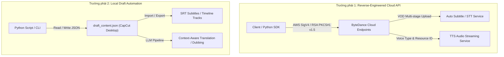

# BÁO CÁO NGHIÊN CỨU TOÀN DIỆN: HỆ SINH THÁI API CAPCUT & JIANYING (剪映)
## Trích Xuất Phụ Đề (ASR/STT), Dịch Thuật (Translation) & Giọng Đọc AI (TTS)

> **Mục tiêu:** Khảo sát, phân tích chuyên sâu các dự án mã nguồn mở trên GitHub liên quan đến CapCut / JianYing; đánh giá ưu/nhược điểm và tính khả thi để tích hợp hoặc mở rộng cho hệ thống **Subtitle Localizer Studio**.

---

## 1. TỔNG QUAN KIẾN TRÚC CAPCUT & JIANYING

CapCut (phiên bản quốc tế) và JianYing (剪映 - phiên bản nội địa Trung Quốc) đều thuộc sở hữu của **ByteDance**. Toàn bộ dịch vụ thông minh (nhận diện giọng nói, tổng hợp giọng đọc, dịch thuật) đều được vận hành trên hạ tầng đám mây **ByteDance AI / Volcano Engine (火山引擎)**.

Trong cộng đồng mã nguồn mở hiện nay, có **hai trường phái giải pháp chính**:

1. **Reverse-Engineered Cloud API (Gọi trực tiếp Endpoint ngầm):**
   - Không cần cài đặt hay mở phần mềm CapCut trên máy.
   - Gọi trực tiếp các máy chủ đám mây của ByteDance (`edit-api-sg.capcut.com`, `openspeech.bytedance.com`, `ulikecam.com`).
   - Yêu cầu xử lý chữ ký bảo mật: Chữ ký AWS SigV4, mã hóa RSA PKCS#1 v1.5, token thiết bị ảo (Device ID / Install ID).

2. **Local Draft Automation (Tự động hóa qua file cấu trúc dự án `draft_content.json`):**
   - Can thiệp trực tiếp vào file cấu trúc JSON của CapCut/JianYing Desktop.
   - Đọc phụ đề sau khi phần mềm chạy Auto-Captions, hoặc bơm phụ đề/âm thanh đã dịch vào timeline.
   - Ưu điểm: 100% ổn định, không bị chặn IP hay thay đổi chữ ký API đám mây.

---

## 2. PHÂN TÍCH THEO TỪNG NHU CẦU CỤ THỂ

### 2.1. Trích Xuất Phụ Đề (Speech-to-Text / ASR / Auto-Captions)

Khả năng nhận diện tiếng nói thành phụ đề của ByteDance được đánh giá là một trong những engine ASR thương mại chuẩn xác nhất hiện nay, đặc biệt là tiếng Trung, tiếng Anh và tiếng Việt xen lẫn.

#### Các Repository tiêu biểu:
1. **[K07VN/capcut-tts-api](https://github.com/K07VN/capcut-tts-api)** *(Tác giả Việt Nam - Đề xuất số 1 cho Cloud API)*
   - **Tech Stack:** Python 3.9+ thuần (không phụ thuộc file C/C++ `.dll` hay native binaries).
   - **Cơ chế hoạt động:**
     - **VOD Chunked Media Upload:** Tải file video/audio lên hạ tầng lưu trữ của ByteDance qua cơ chế chunked upload, ký request bằng chuẩn AWS SigV4 thuần Python.
     - **Tạo task STT:** Gọi API nhận diện âm thanh với tham số `audio_vid`, `audio_md5`, `duration_ms` và `language` (hỗ trợ `vi-VN`, `zh-CN`, `en-US`...).
     - **Polling & Subtitle Parser:** Tự động thăm dò trạng thái tác vụ cho đến khi hoàn thành, trích xuất cấu trúc phụ đề hoàn chỉnh gồm câu thoại (utterances), thời gian bắt đầu/kết thúc (timestamp mili-giây) và căn chỉnh từng từ (word timings).

2. **[czzonet/jianying-subtitle-export](https://github.com/czzonet/jianying-subtitle-export)** & **[barashik07/capsrt](https://github.com/barashik07/capsrt)**
   - **Tech Stack:** Python / Node.js.
   - **Cơ chế hoạt động:**
     - Người dùng nạp video vào CapCut PC và nhấn tính năng **Auto Captions** (Tạo phụ đề tự động).
     - Script tự động quét thư mục dự án CapCut (`com.lveditor.draft`), đọc file `draft_content.json` (hoặc `draft_info.json`), bóc tách các text segments và xuất ra file chuẩn `.srt`.
   - **Ưu điểm:** Tận dụng 100% tài nguyên nhận diện miễn phí của phần mềm CapCut mà không lo bị chặn API.

---

### 2.2. Giọng Đọc AI & Lồng Tiếng (Text-to-Speech - TTS)

CapCut sở hữu danh mục giọng đọc lồng tiếng (Voice Catalog) đồ sộ, đặc biệt là các giọng đọc tin tức, truyện đêm muộn, và giọng "review phim TikTok" rất quen thuộc tại Việt Nam và Trung Quốc.

#### Các Repository tiêu biểu:
1. **[K07VN/capcut-tts-api](https://github.com/K07VN/capcut-tts-api)**
   - **Cơ chế Voice Resolution:** SDK tích hợp sẵn file danh mục `Voice.json`. Khi người dùng truyền `voice="BV421_vivn_streaming"` (giọng nữ review tiếng Việt) hoặc `BV074_streaming` (giọng review chuẩn), SDK tự động map sang mã `resource_id` tương ứng trên máy chủ CapCut.
   - **Bảo mật:** Tích hợp mã hóa RSA PKCS#1 v1.5 thuần Python để mã hóa gói tin gửi lên máy chủ ByteDance.
   - **Chế độ phát:** Hỗ trợ tạo tác vụ đồng bộ (`wait=True`) nhận trực tiếp stream MP3 hoặc bất đồng bộ (Async task polling).

2. **[kuwacom/CapCut-TTS](https://github.com/kuwacom/CapCut-TTS)**
   - **Tech Stack:** Node.js, Express, Docker.
   - **Cơ chế:** Đóng vai trò là một Wrapper API self-hosted. Xác thực bằng cookie/tài khoản CapCut Web (`edit-api-sg.capcut.com`), cung cấp RESTful API để lấy danh sách giọng đọc và tải file âm thanh đã sinh.

3. **[index-tts-jianying](https://github.com/MrCuriosity74/index-tts-jianying)**
   - **Tech Stack:** Python Flask.
   - **Cơ chế:** Chuyên dụng cho các giọng đọc tiếng Trung của JianYing (giọng cổ phong, phim truyền hình Trung Quốc, giọng hoạt hình).

---

### 2.3. Dịch Thuật Phụ Đề (Translation)

#### Thực tế kỹ thuật về dịch thuật trong CapCut:
- Bản thân CapCut/JianYing có tính năng "Bilingual Subtitle / Auto-translate" (dịch song ngữ). Tuy nhiên, backend của tính năng này là hệ thống **Volcano Machine Translation (MT)** truyền thống của ByteDance.
- **Hạn chế của dịch thuật gốc CapCut:** Dịch theo từng dòng đơn lẻ (word-by-word hoặc sentence-by-sentence), không hiểu ngữ cảnh toàn bộ tập phim, dẫn đến dịch sai đại từ nhân xưng (anh/em, cô/chú, mày/tao) và làm hỏng văn phong điện ảnh.
- **Giải pháp tối ưu của cộng đồng:**
  - Thay vì cố gắng bẻ khóa API dịch thuật của CapCut, các dự án hiện đại kết hợp: **Trích xuất phụ đề từ CapCut -> Đưa qua mô hình LLM (Gemini Flash / Claude / OpenAI) để dịch theo ngữ cảnh -> Bơm ngược lại vào CapCut**.
  - **[renezander030/capcut-cli](https://github.com/renezander030/capcut-cli):** Cung cấp lệnh CLI `capcut-cli translate`, tự động đọc các layer chữ trong `draft_content.json`, gửi qua LLM dịch và cập nhật lại bản dịch vào project.
  - **[GhostCut-auto_video_translation](https://github.com/JollyToday/GhostCut-auto_video_translation):** Hệ thống tự động hóa dịch video đa ngôn ngữ (tách sub, xóa text gốc, dịch và lồng tiếng AI).

---

## 3. BẢNG SO SÁNH CÁC REPOSITORY HÀNG ĐẦU

| Repository | Sao (Stars) | Ngôn ngữ | Tính năng chính | Đánh giá độ ổn định | Bản quyền |
| :--- | :--- | :--- | :--- | :--- | :--- |
| **[K07VN/capcut-tts-api](https://github.com/K07VN/capcut-tts-api)** | Nổi bật tại VN | Python | **TTS + STT Cloud API** (Voice Catalog, Auto Subtitle, AWS SigV4, RSA) | Cao (Pure Python, không cần cài app) | Open Source |
| **[GuanYixuan/pyJianYingDraft](https://github.com/GuanYixuan/pyJianYingDraft)** | ~2k+ | Python | **Điều khiển Timeline CapCut/JianYing** (Tạo draft, add track, chèn sub, xuất video) | Cực cao (khuyến nghị dùng CapCut v5.9.x) | MIT |
| **[ashreo/CapCutAPI](https://github.com/ashreo/CapCutAPI)** | Tăng trưởng nhanh | Python | RESTful API & Model Context Protocol (MCP) cho CapCut Draft | Cao (thích hợp cho AI Agent) | Apache-2.0 |
| **[renezander030/capcut-cli](https://github.com/renezander030/capcut-cli)** | Active | Python | CLI quản lý draft, import SRT, tự động dịch (LLM translate) | Rất tốt cho workflow dòng lệnh | MIT |
| **[czzonet/jianying-subtitle-export](https://github.com/czzonet/jianying-subtitle-export)** | Phổ biến | Python | Xuất phụ đề nhận diện từ JianYing sang `.srt` | Ổn định tuyệt đối (offline) | MIT |
| **[kuwacom/CapCut-TTS](https://github.com/kuwacom/CapCut-TTS)** | Cộng đồng quốc tế | JavaScript | Server Docker RESTful TTS CapCut Web | Trung bình (phụ thuộc session web) | MIT |

---

## 4. ĐÁNH GIÁ & KHUYẾN NGHỊ CHO SUBTITLE LOCALIZER STUDIO

Đối chiếu với kiến trúc hiện tại của dự án **Subtitle Localizer Studio** (FastAPI backend, React frontend, Gemini Key Pool 43 keys, Edge-TTS, RapidOCR ONNX):

### 1. Về Trích Xuất Phụ Đề (Subtitle Extraction):
* **Đối với Video có chữ sẵn trên màn hình (Hardsub):**
  * Hệ sinh thái CapCut **không** chuyên về OCR chữ dính trên hình (nó chỉ làm ASR nhận diện âm thanh).
  * Bộ **RapidOCR ONNX + PTS-based sync** hiện tại của Studio vẫn là giải pháp số 1 để bóc tách hardsub từ video mạng xã hội.
* **Đối với Video chỉ có tiếng nói (chưa có chữ):**
  * Tích hợp thêm **STT Adapter**: Có thể tham khảo module `client.build_stt_new_request()` của `K07VN/capcut-tts-api` để người dùng có thêm lựa chọn "Nhận diện phụ đề bằng giọng nói qua CapCut Cloud".
  * Ngoài ra, việc tận dụng **Faster-Whisper** (đã có sẵn trong môi trường Python của máy) cho phép nhận diện giọng nói 100% offline không giới hạn thời lượng.

### 2. Về Giọng Đọc AI (TTS):
* Hiện tại hệ thống đang dùng **Edge-TTS** (Microsoft Neural Voice: `vi-VN-HoaiMyNeural`, `vi-VN-NamMinhNeural` rất trong trẻo, ổn định).
* **Đề xuất nâng cấp:** Có thể tham khảo cách gọi API của `K07VN/capcut-tts-api` để bổ sung thêm tab **CapCut Voice** (với các mã giọng quen thuộc như `BV421_vivn_streaming`), giúp người dùng có thêm phong cách đọc review phim TikTok đặc trưng.

### 3. Về Dịch Thuật (Translation):
* **Khuyến nghị giữ nguyên:** Tiếp tục sử dụng **Gemini Keys Pool** với prompt dịch ngữ cảnh điện ảnh của Studio. Bản dịch của Gemini 1.5/2.0 Flash vượt trội hơn hẳn dịch máy của CapCut về mặt xưng hô, văn phong tự nhiên và bắt kịp tiếng lóng.

### 4. Về Tương Thích Xuất Bản (Export):
* Nếu muốn người dùng sau khi dịch xong có thể mở ngay trên CapCut để edit tiếp: Sử dụng thư viện **`pyJianYingDraft`** để xuất thẳng ra thư mục dự án của CapCut (`draft_content.json`). Người dùng chỉ cần mở CapCut lên là toàn bộ video, timeline, phụ đề tiếng Việt đã được xếp sẵn đúng vị trí.
